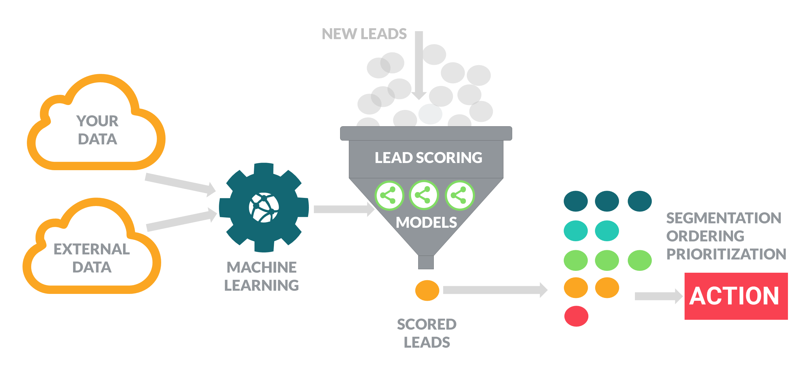
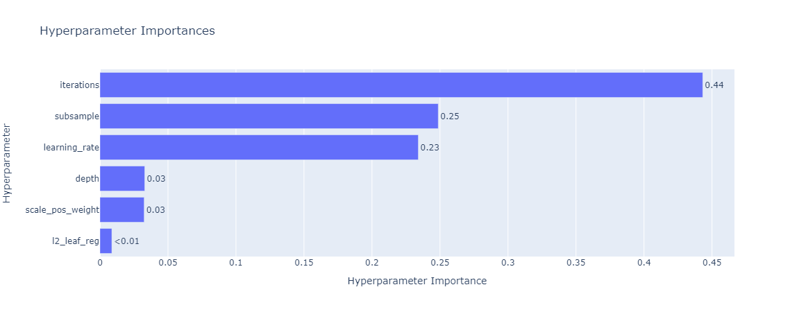
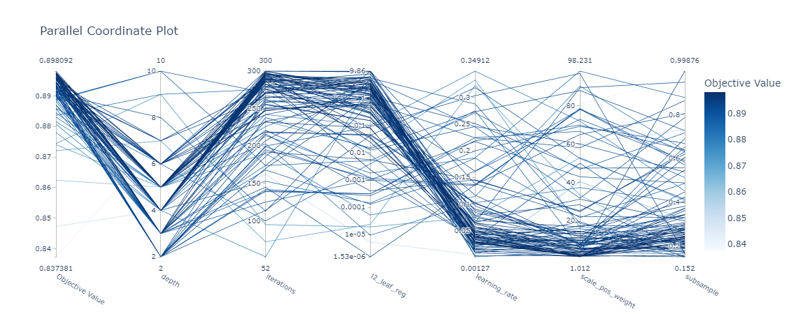
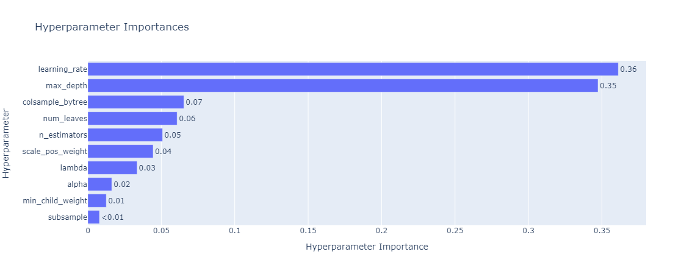
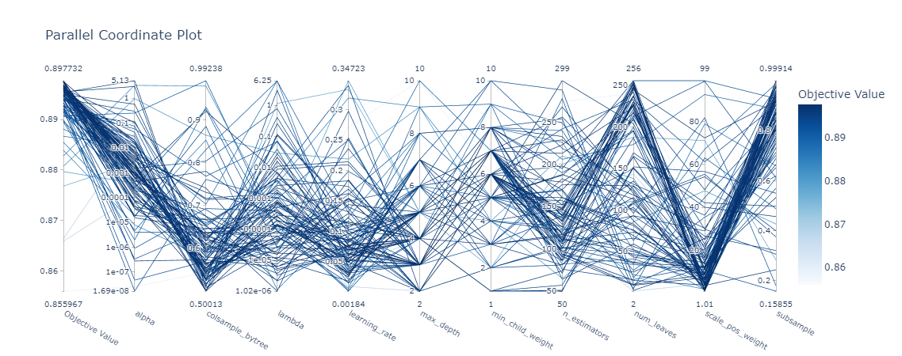
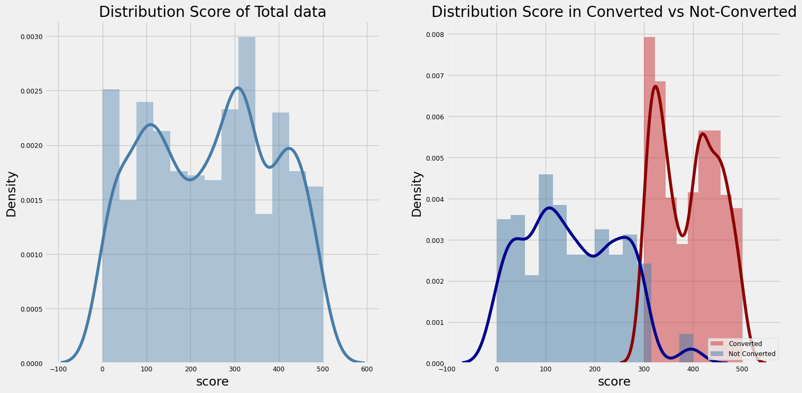

# Developing machine learning models for lead scoring in customer relationship management
---
## Introduction
- This project aims to develop a machine learning model to automate the process of scoring potential customers (lead scoring) in Customer Relationship Management (CRM). The primary goal is to provide a tool that helps businesses better understand the potential of each customer, thereby optimizing outreach strategies and enhancing sales effectiveness.

  

## Using the Model
- This model allows businesses to automate the scoring of lead customers based on various criteria including online behavior, and interactions with campaigns. Below is a flow illustrating how the model operates:

  

## Results
- The model has achieved notable results in classifying and predicting potential customers with a high likelihood of conversion. Below are some charts and tables demonstrating the effectiveness of the model:

| SHAP       | Train Accuracy | Train F1-score | Train Gini | Test Accuracy | Test F1-score | Test Gini |
|------------|----------------|----------------|------------|---------------|---------------|-----------|
| CatBoost 0 | 0.8388         | 0.870          | 0.830      | 0.8371        | 0.866         | 0.816     |
| CatBoost 1 |                | 0.787          |            |               | 0.793         |           |
| LightGBM 0 | 0.8347         | 0.867          | 0.818      | 0.8355        | 0.865         | 0.817     |
| LightGBM 1 |                | 0.781          |            |               | 0.789         |           |

- This model helps businesses identify and focus resources on potential customers with high conversion potential, thereby optimizing sales and marketing strategies.

**Hyperparameters Turning**  
_CatBoost_

  

  

_LightGBM_

  

  

**Score**

  

